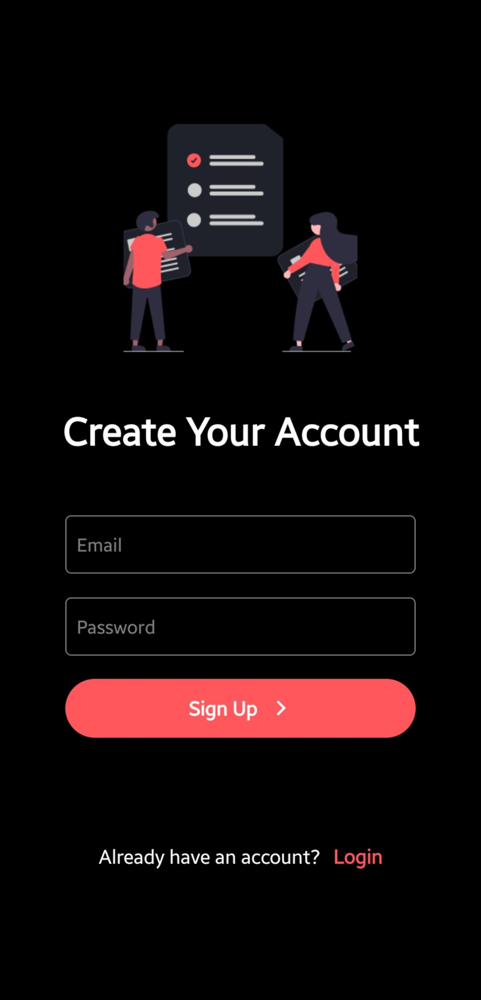
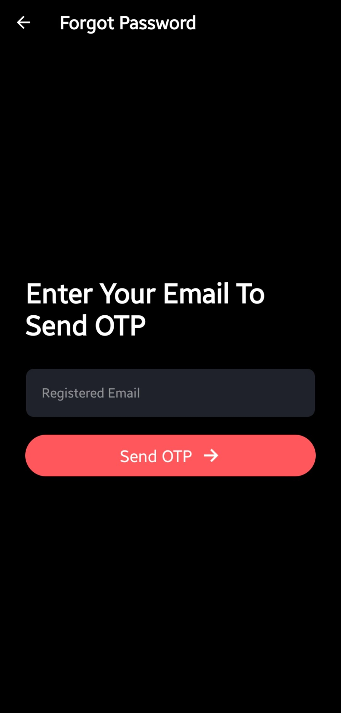
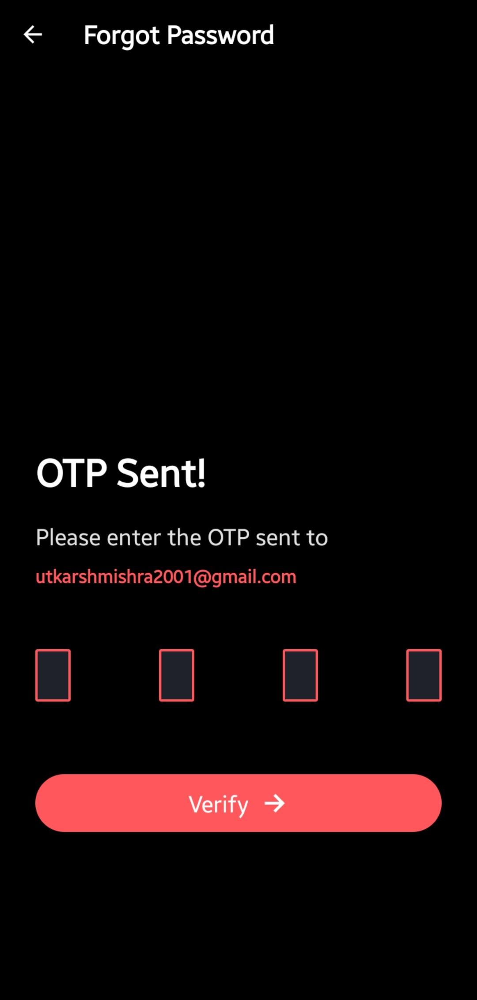
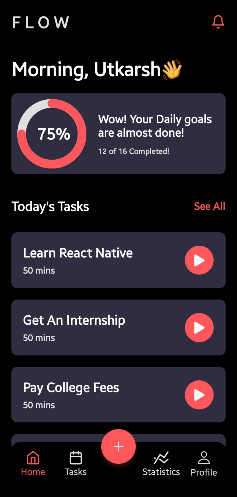
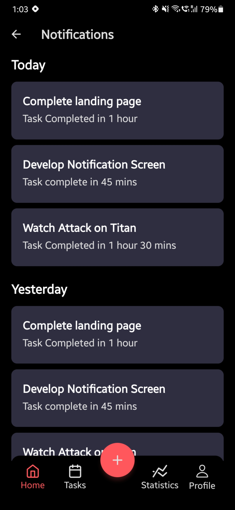
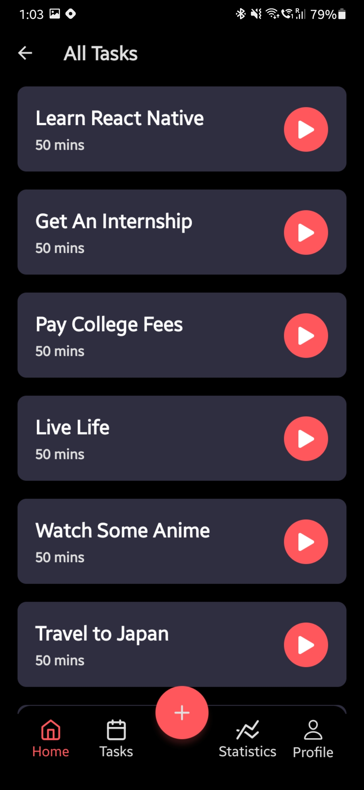
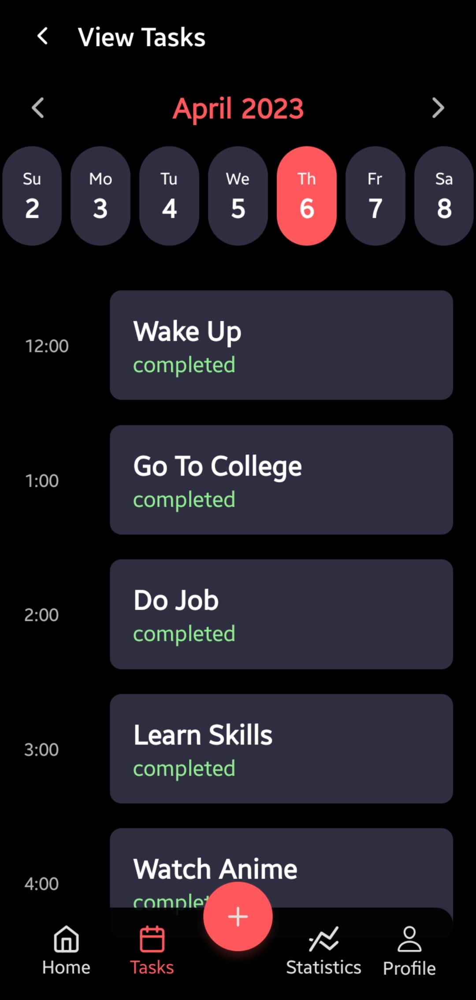
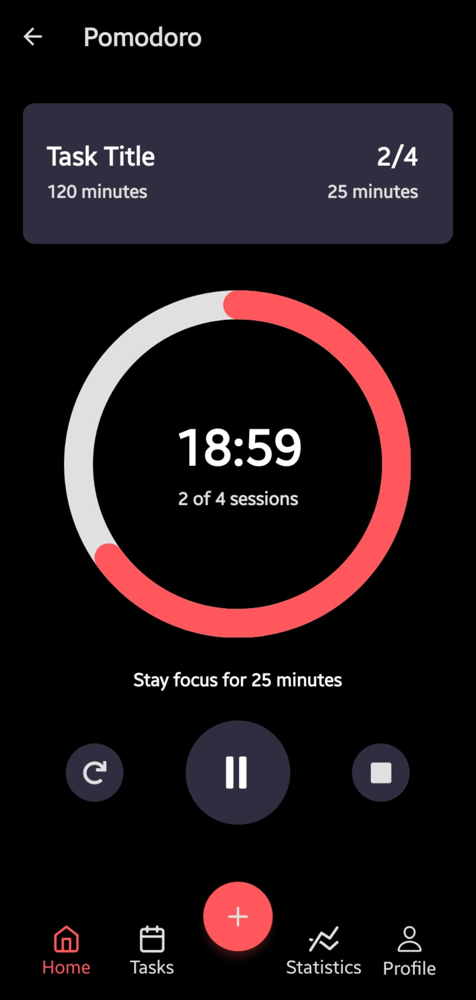
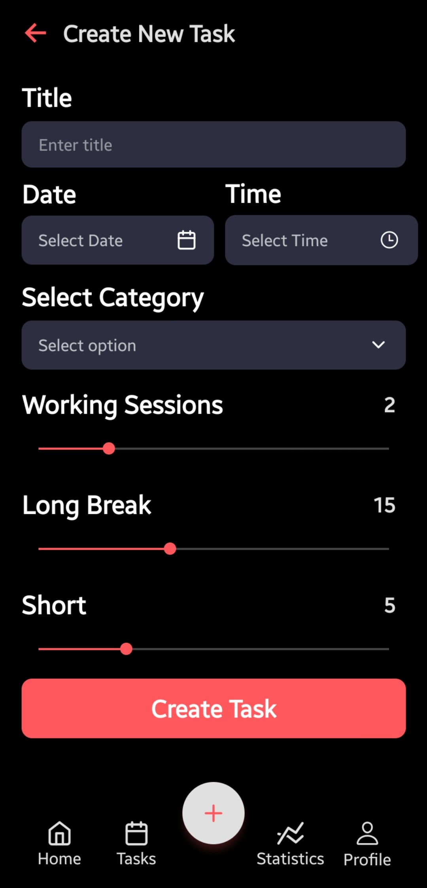
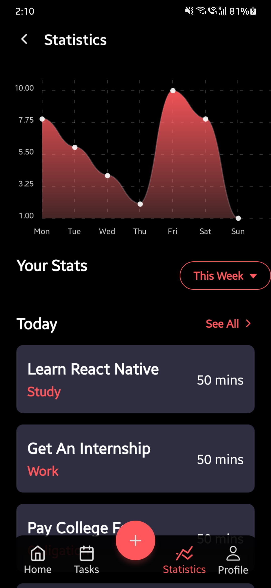

# FLOW App 🧠

FLOW is a cross-platform mobile application built using React Native CLI. The app provides various features such as user authentication, a Pomodoro timer, statistical data of productive time using charts, and day planning with a calendar.

[Figma Design]([Figma](https://www.figma.com/file/oZxpQoXpXa0OtuLKtlunLJ/Pomo---Pomodoro-%26-Timer-App-UI-Kit-(Community)?node-id=0%3A1&t=k3yaLaklPcdwo1eM-0))

## What I Learned Building FLOW 😎

Here's what all I learn't and what I'm still yet to learn  along the journey to complete the app

- Firebase Authentication (Login & Logout)✅
- User Registration using Firebase✅
- React Navigation (Stack + Tab)✅
- Using Doughnut Charts✅
- Showing Detailed Statistics using Line Chart✅
- Styling Header and Bottom Navigation✅
- Rendering Lists (Scroll View and Flatlist)✅
- ReduxToolkit + ReduxThunk (⚠️Still trying to impliment)
- Using OTP to login (UI ready, Functionality to be implimented) ⚠️
- Storing Data in android SQLite ⚠️
- Fetching and storing data in central store⚠️

  <h1>Screens Built</h1>
  
I'll Be Adding More As I Complete Them😄

   
  

    
    
    
  

  

    
    
    
  

  

    
    
    
  

  

    
    
    
  

## Features 🔮

### User Authentication 🔒

FLOW provides multiple options for user authentication, including email, Google, and phone number. Users can select their preferred method to sign up and log in to the app.

### Pomodoro Timer 🍅

The Pomodoro timer feature of FLOW allows users to track their time spent on a task and take breaks at regular intervals. Users can customize the timer duration according to their preference.

### Statistical Data of Productive Time Using Charts 📊

FLOW provides statistical data of productive time using charts, which allows users to track their progress and improve their productivity. The app presents data in an easily understandable format for users to analyze and make informed decisions.

### Day Planning with Calendar 📅

FLOW provides a day planning feature that allows users to schedule their tasks and events in a calendar. Users can add and modify events, set reminders, and view their schedule for the day.

## Installation ⬇️

To install FLOW on your device, follow these steps:

1. Clone the repository to your local machine.
2. Navigate to the project directory.
3. Run `npm install` to install the necessary dependencies.
4. Run `react-native run-android` to run the app on an Android device, or `react-native run-ios` to run the app on an iOS device.

## Conclusion

In conclusion, FLOW is a powerful mobile app that can help users improve their productivity and manage their tasks effectively. The app's features, including user authentication, a Pomodoro timer, statistical data of productive time using charts, and day planning with a calendar, make it a valuable tool for anyone looking to improve their productivity.

Feel Free To Suggest any Changes, and Contribute😊
